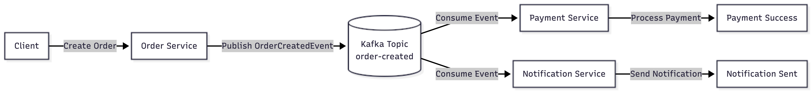
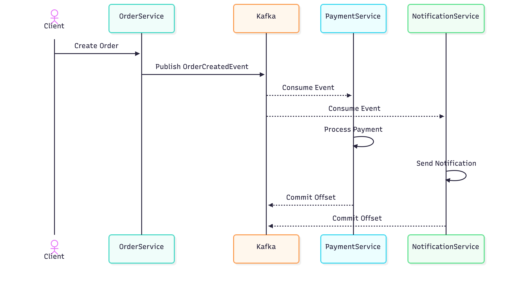
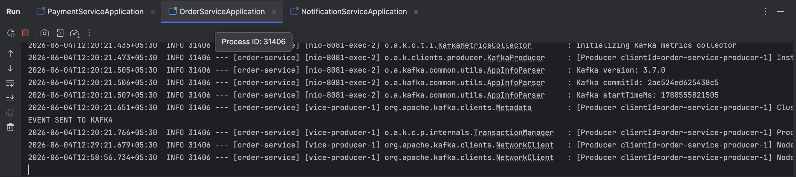
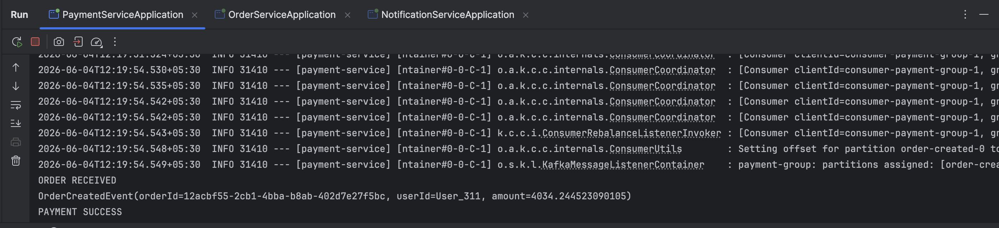
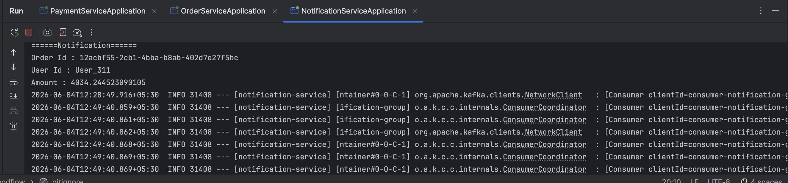

# FoodFlow

> Event-driven food ordering platform built with Spring Boot and Apache Kafka

[](https://openjdk.org/projects/jdk/17/)
[](https://spring.io/projects/spring-boot)
[](https://kafka.apache.org/)
[](https://docs.docker.com/compose/)

---

## Overview

FoodFlow demonstrates a **production-style event-driven microservices architecture** where services communicate asynchronously through Apache Kafka instead of tightly coupled REST calls.

When a new order is placed:

1. **Order Service** publishes an `OrderCreatedEvent` to Kafka
2. **Payment Service** consumes the event and processes the payment
3. **Notification Service** consumes the same event and dispatches user notifications

Both consumers receive every event independently via separate **consumer groups**, implementing the Publish-Subscribe pattern.

---

## Architecture



---

## Event Flow



---

## Tech Stack

| Category         | Technology             |
|------------------|------------------------|
| Language         | Java 17                |
| Framework        | Spring Boot 3.3.0      |
| Messaging        | Apache Kafka           |
| Build Tool       | Maven                  |
| Containerisation | Docker, Docker Compose |
| Utilities        | Lombok                 |

---

## Project Structure

```
foodflow/
├── common-events/          # Shared contracts (DTOs, event models)
├── order-service/          # Publishes order events
├── payment-service/        # Processes payments
├── notification-service/   # Sends user notifications
└── docker-compose.yml      # Kafka + Zookeeper setup
```

---

## Services

### Order Service — Producer

Accepts incoming order requests, generates a unique `orderId`, and publishes an `OrderCreatedEvent` to the `order-created` Kafka topic.



---

### Payment Service — Consumer (`payment-group`)

Subscribes to `order-created`, processes the payment, and logs confirmation on success.



---

### Notification Service — Consumer (`notification-group`)

Subscribes to `order-created` and dispatches a notification to the user.



---

### Common Events Module

Shared library installed as a local Maven dependency. Contains all event contracts to enforce consistency across services.

```java
@Data
@AllArgsConstructor
@NoArgsConstructor
public class OrderCreatedEvent {
    private String orderId;
    private String userId;
    private Double amount;
}
```

---

## Event Schema

**Topic:** `order-created`

```json
{
  "orderId": "6537c0ba-9a07-462a-a23a-068bed027beb",
  "userId":  "User_936",
  "amount":  7287.31
}
```

---

## Getting Started

### Prerequisites

- Java 17+
- Maven 3.8+
- Docker & Docker Compose

### 1. Clone the repository

```bash
git clone https://github.com/<username>/foodflow-event-driven-microservices.git
cd foodflow-event-driven-microservices
```

### 2. Start Kafka

```bash
docker-compose up -d
```

### 3. Build the shared module

```bash
cd common-events && mvn clean install && cd ..
```

### 4. Start the services

Run each in a separate terminal:

```bash
# Terminal 1
cd order-service && mvn spring-boot:run

# Terminal 2
cd payment-service && mvn spring-boot:run

# Terminal 3
cd notification-service && mvn spring-boot:run
```

---

## Key Concepts

| Concept                   | Implementation                              |
|---------------------------|---------------------------------------------|
| Event-Driven Architecture | Services communicate via Kafka events       |
| Publish-Subscribe Pattern | Multiple consumers receive the same event   |
| Consumer Groups           | `payment-group`, `notification-group`       |
| Shared Contracts          | `common-events` module used by all services |
| Asynchronous Communication| No direct service-to-service calls          |
| Containerised Messaging   | Kafka + Zookeeper via Docker Compose        |

---

## Author

**Tarsem Gulab**

---
